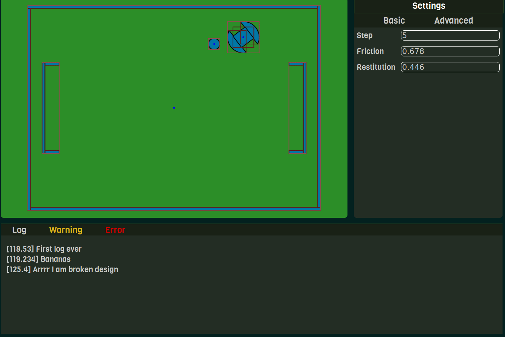

# RSS
Rapid Simple (Soccer) Simulator

It is an attempt to make a convenient and really simple to use robotics simulator. Under development for now. Mostly directed towards Robocup Junior Soccer leagues

## Showcase



## Technical details

Made in a quite complicated manner: GUI is made in Electron + NodeJS, but the engine is C++.

Moreover, so that in the future it should be possible to have different engines, and different GUIs (for example, the engine could fetch data from real-time robot, instead of it being simulated, thus allowing for control being seamlessly tested both on simulation and on real robot), both engine and node js app are made completly isolated from each other, thus leading to a nice abstraction level independence.

Moreover, Docker is used, so that this 'complicated' structure, and building, and everything, is isolated into a singular container, which is easy to transfer, and run, and debug.

Also OpenMP is used in few places to speedup the computation, but effects are minimal, thus not really that interesting.

## What to do

To build a docker container with development evironment execute ```build.sh``` (from correct ```docker scripts/your platform``` folder):
``` 
sh build.sh
``` 
or using docker command:
```
docker build -t rss-dev - < dev.Dockerfile
```

To start container with GUI available (container must be built already):
```
sh run.sh
```
To launch the app from inside the container execute the ```app/start.sh``` from the ```app``` folder:
```
cd /workspace/app
sh start.sh
```
Then you will see the GUI and some logs in console, which show that C++ addons loaded succesfully. There could be a huge number of errors, because of the docker, you can simply ignore them.


P.S. In run.sh there is a complicated command that allows docker to share screen with actual linux xserver desktop. It was quite hard to find it, and make it work, and it is an interesting use case - for example, most of people I know don't know that docker is capable of showing application in actual GUI, as apps.
